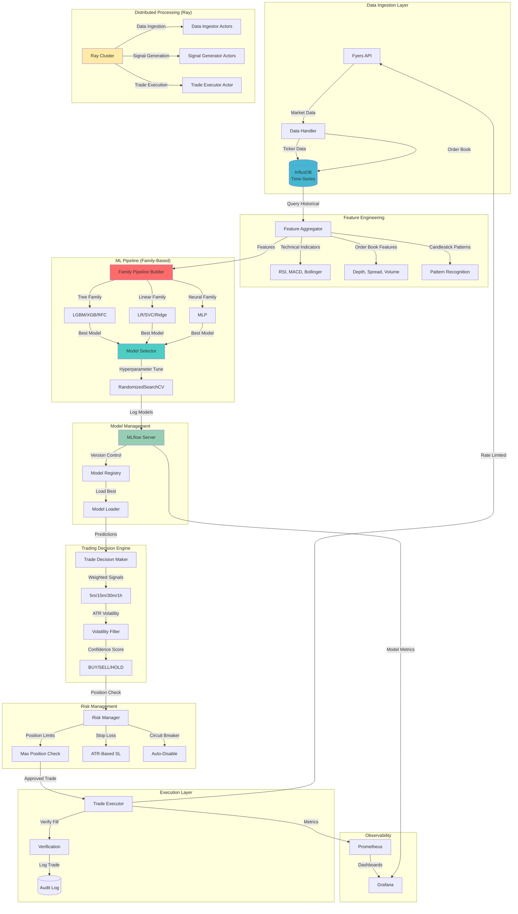

<div align="center">

# 📈 Automated Trading System

**Production-Grade ML-Powered Trading Platform for Indian Equity Markets**

*Automated trading with multi-model ML pipelines, real-time risk management, and distributed processing for 100+ symbols*

[](https://www.python.org/)
[](https://mlflow.org/)
[](https://ray.io/)
[](https://www.influxdata.com/)
[](LICENSE)

</div>

---

## 🎯 Project Overview

**Automated Trading System** is a production-grade, ML-powered trading platform designed for Indian equity markets (NSE/BSE). Built to demonstrate expertise in **machine learning**, **distributed systems**, **time-series analysis**, and **financial risk management**, this system transforms raw market data into profitable trading signals through intelligent model selection and automated execution.

### Core Value Proposition

- **Multi-Model Architecture**: Family-based ML pipeline with automatic model type selection (Tree, Linear, Neural) as hyperparameter
- **Distributed Processing**: Ray-based parallel processing handles **100+ symbols** simultaneously with fault tolerance
- **Real-Time Risk Management**: Position limits, stop-loss, volatility filters, and circuit breakers prevent catastrophic losses
- **Production-Ready**: MLflow model tracking, InfluxDB time-series storage, comprehensive monitoring, and automated backups

### Target Use Cases

- **Quantitative Traders**: Automated signal generation and execution for systematic trading strategies
- **ML Engineers**: Production-grade ML pipeline with model versioning, A/B testing, and performance tracking
- **Algorithmic Trading**: High-frequency data ingestion, feature engineering, and low-latency execution
- **Research & Development**: Backtesting framework, model comparison, and strategy optimization

---

## 🏗️ System Architecture

The system uses a **distributed, event-driven architecture** with ML model training, real-time prediction, and automated trade execution.



### Architecture Highlights

- **Family-Based ML Pipeline**: Model type (LGBM, XGB, SVC, MLP) is a tunable hyperparameter with auto-determined preprocessing
- **Distributed Processing**: Ray actors handle parallel data ingestion and signal generation across 100+ symbols
- **Time-Series Optimized**: InfluxDB stores ticker data, order book, and features with sub-second query performance
- **Model Versioning**: MLflow tracks experiments, models, and artifacts with automatic model registry
- **Risk-First Design**: Multiple safety layers (position limits, stop-loss, circuit breakers) prevent catastrophic losses
- **Real-Time Execution**: Fyers API integration with rate limiting, slippage monitoring, and trade verification

---

## 🛠️ Technology Stack

### Core Platform

| Component | Technology | Rationale |
|-----------|-----------|-----------|
| **ML Framework** | scikit-learn + LightGBM/XGBoost | Industry-standard ML pipelines with GPU-accelerated gradient boosting |
| **Model Tracking** | MLflow | Complete experiment tracking, model versioning, and artifact management |
| **Distributed Computing** | Ray | Actor-based parallelism for 100+ symbols with fault tolerance |
| **Time-Series DB** | InfluxDB | Optimized for high-frequency market data with sub-second queries |
| **Feature Engineering** | pandas + TA-Lib | Technical indicators, order book features, candlestick patterns |
| **Risk Management** | Custom | Position limits, ATR-based stop-loss, volatility filters, circuit breakers |

### Infrastructure & DevOps

| Component | Technology | Rationale |
|-----------|-----------|-----------|
| **Container Runtime** | Podman (Rootless) | BTRFS-compatible, secure containerization |
| **Orchestration** | podman-compose | Multi-container orchestration for MLflow, InfluxDB, Grafana |
| **Monitoring** | Prometheus + Grafana | Real-time metrics, dashboards, alerting |
| **Backup System** | Automated Scripts | Daily full + hourly incremental backups with retention policies |
| **Health API** | FastAPI | Health checks, metrics endpoint, Kubernetes-ready |

### Trading & APIs

| Component | Technology | Rationale |
|-----------|-----------|-----------|
| **Broker API** | Fyers API v3 | Indian equity market execution (NSE/BSE) with rate limiting |
| **Authentication** | OAuth2 + TOTP | Secure broker authentication with 2FA support |
| **Data Source** | Fyers WebSocket + REST | Real-time ticker data and historical OHLCV |
| **Order Book** | Fyers Depth API | Level-2 market depth for order book features |

### ML & Feature Engineering

| Component | Technology | Rationale |
|-----------|-----------|-----------|
| **Feature Selection** | LGBM Importance, SHAP, RFE | Model-consistent feature selection with interpretability |
| **Preprocessing** | ColumnTransformer | Mixed-type data handling (numeric + categorical) |
| **Hyperparameter Tuning** | RandomizedSearchCV | Time-series aware cross-validation with proportional resource budgeting |
| **Model Families** | Tree/Linear/Distance/Neural | Auto-determined preprocessing per model family |

---

## 🚀 Critical Features

### 1. **Multi-Model Family Architecture**

Revolutionary ML pipeline design where **model type is a hyperparameter**:

- **Model Families**: Tree (LGBM/XGB/RFC), Linear (LR/SVC/Ridge), Distance (KNN/SVC), Neural (MLP), Baseline (LR/DT)
- **Auto-Preprocessing**: Each family has optimal preprocessing (Tree: no scaling, Linear: StandardScaler + OneHot)
- **Proportional Resource Budgeting**: `n_iter = base * num_models` ensures fair model comparison
- **Model Type Tuning**: RandomizedSearchCV automatically selects best model type alongside hyperparameters

**Why This Matters**: Eliminates manual model selection, enabling automatic discovery of optimal model architecture for each symbol/timeframe.

### 2. **Distributed Processing with Ray**

Handles **100+ symbols** simultaneously with fault tolerance:

- **Actor-Based Architecture**: Separate actors for data ingestion, signal generation, trade execution
- **Fault Tolerance**: Actor failures don't crash the system, automatic retry with exponential backoff
- **Resource Management**: Dynamic actor scaling based on symbol count and hardware capacity
- **Coordinator Pattern**: Central coordinator manages actor lifecycle and task distribution

**Why This Matters**: Enables production-scale trading across entire market universe without sequential bottlenecks.

### 3. **Time-Series Optimized Data Pipeline**

InfluxDB stores high-frequency market data with sub-second query performance:

- **High-Frequency Ingestion**: 5-minute primary interval with support for 1-minute granularity
- **Order Book Storage**: Level-2 market depth stored for order book feature engineering
- **Efficient Queries**: Flux queries optimized for technical indicator calculations
- **Data Retention**: Configurable retention policies for cost optimization

**Why This Matters**: Handles millions of data points efficiently, enabling real-time feature engineering and backtesting.

### 4. **Advanced Feature Engineering**

Comprehensive feature set combining multiple data sources:

- **Technical Indicators**: RSI, MACD, Bollinger Bands, Stochastic, ADX, EMA, ATR, CCI, Ichimoku Cloud
- **Order Book Features**: Bid-ask spread, depth imbalance, volume-weighted prices, order flow
- **Candlestick Patterns**: 20+ pattern recognition (Doji, Hammer, Engulfing, etc.)
- **Company Metadata**: Sector, market cap, P/E ratio, fundamentals (optional enrichment)

**Why This Matters**: Rich feature set enables ML models to capture complex market patterns and micro-structure effects.

### 5. **Production-Grade Model Management**

MLflow integration for complete model lifecycle:

- **Experiment Tracking**: All training runs logged with parameters, metrics, and artifacts
- **Model Registry**: Production model versioning with staging/production promotion
- **Artifact Storage**: Feature importance, confusion matrices, prediction samples stored
- **Model Comparison**: Compare models across experiments, timeframes, and symbols

**Why This Matters**: Enables systematic model improvement, A/B testing, and production model rollback.

### 6. **Risk-First Trading Execution**

Multiple safety layers prevent catastrophic losses:

- **Position Limits**: Hard caps on position size per symbol and total portfolio
- **ATR-Based Stop Loss**: Dynamic stop-loss based on Average True Range (volatility-adjusted)
- **Volatility Filters**: Skip trades during high volatility periods
- **Circuit Breakers**: Auto-disable trading after N consecutive failures
- **Cooldown Periods**: Prevent rapid-fire trades on same symbol
- **Slippage Monitoring**: Track expected vs actual fill prices

**Why This Matters**: Protects capital while enabling automated execution, meeting institutional risk management standards.

### 7. **Intelligent Trade Decision Making**

Multi-timeframe signal aggregation with confidence scoring:

- **Timeframe Weights**: 5m=1x, 15m=2x, 30m=3x, 1h=4x (longer timeframes weighted higher)
- **ATR Volatility Assessment**: Adjusts confidence based on market volatility
- **Probability Weighting**: Uses prediction probabilities, not just class labels
- **Timeframe Agreement**: Requires multiple timeframes to agree for high-confidence trades

**Why This Matters**: Reduces false signals and improves trade quality by requiring consensus across multiple timeframes.

### 8. **Hardware-Aware Optimization**

Automatic resource optimization based on available hardware:

- **GPU Detection**: Automatically uses GPU for LightGBM/XGBoost if available
- **CPU Optimization**: Adjusts `n_jobs` and `n_iter` based on CPU cores and RAM
- **Memory Management**: Limits training data size based on available RAM
- **Adaptive Sampling**: Reduces sample size for hardware-constrained environments

**Why This Matters**: Maximizes performance on any hardware, from laptops to high-end servers.

### 9. **Comprehensive Monitoring & Observability**

Real-time visibility into system health and trading performance:

- **Prometheus Metrics**: Trading metrics, model performance, API latency, error rates
- **Grafana Dashboards**: Pre-built dashboards for system health, trading P&L, model metrics
- **Health API**: `/health`, `/healthz`, `/ready`, `/metrics` endpoints for Kubernetes
- **Structured Logging**: JSON logs with trace IDs for distributed tracing

**Why This Matters**: Enables proactive monitoring, debugging, and performance optimization.

### 10. **Automated Backup & Recovery**

Production-grade data protection:

- **Daily Full Backups**: Complete InfluxDB and MLflow backups
- **Hourly Incremental**: Fast recovery point objectives
- **Retention Policies**: Configurable retention (default: 7 days full, 24 hours incremental)
- **Automated Cleanup**: Prevents disk space exhaustion

**Why This Matters**: Protects against data loss and enables disaster recovery.

### 11. **Multi-Channel Notifications**

Real-time alerts for critical events:

- **Slack Integration**: Trading alerts, system errors, model training completion
- **Telegram Support**: Legacy notification channel (deprecated)
- **Webhook Support**: Generic webhook integration for custom alerts

**Why This Matters**: Keeps traders informed of system status and trading activity in real-time.

### 12. **Backtesting Framework**

Comprehensive backtesting capabilities:

- **Historical Data**: Loads from InfluxDB for any date range
- **Walk-Forward Analysis**: Time-series cross-validation prevents look-ahead bias
- **Performance Metrics**: Sharpe ratio, max drawdown, win rate, P&L tracking
- **Slippage & Fees**: Realistic execution costs included in backtests

**Why This Matters**: Validates strategies before live trading, preventing costly mistakes.

---

## 🧠 Architectural Design Decisions

### Why Family-Based ML Pipeline?

**Decision**: Use model families with auto-determined preprocessing instead of manual model selection.

**Rationale**:
- **Model type as hyperparameter**: Enables automatic discovery of optimal architecture
- **Preprocessing correctness**: Ensures mathematical correctness (e.g., SVC gets scaling, LGBM doesn't)
- **Efficiency**: Proportional resource budgeting ensures fair model comparison
- **Scalability**: Easy to add new models by commenting/uncommenting in config

**Trade-offs**:
- ✅ Eliminates manual model selection, enabling systematic optimization
- ✅ Prevents preprocessing errors (e.g., unscaled data for linear models)
- ⚠️ Requires understanding model families (acceptable for ML engineers)
- ⚠️ More complex than single-model pipelines (acceptable for production system)

### Why InfluxDB for Time-Series?

**Decision**: Use InfluxDB for market data storage instead of PostgreSQL or MongoDB.

**Rationale**:
- **Time-series optimization**: Designed specifically for high-frequency time-stamped data
- **Query performance**: Sub-second queries on millions of data points
- **Data compression**: Efficient storage for high-volume market data
- **Flux language**: Powerful query language for technical indicator calculations

**Trade-offs**:
- ✅ Handles 100+ symbols with 5-minute intervals efficiently
- ✅ Enables real-time feature engineering and backtesting
- ⚠️ Not ACID-compliant (acceptable for market data, not transactional)
- ⚠️ Requires separate MLflow for model metadata (acceptable separation)

### Why Ray for Distributed Processing?

**Decision**: Use Ray for distributed processing instead of multiprocessing or Dask.

**Rationale**:
- **Actor model**: Natural fit for stateful trading actors (data ingestor, signal generator)
- **Fault tolerance**: Actor failures don't crash entire system
- **Dynamic scaling**: Can scale actors based on symbol count
- **Resource efficiency**: Better resource utilization than static multiprocessing pools

**Trade-offs**:
- ✅ Enables processing 100+ symbols simultaneously
- ✅ Fault-tolerant architecture prevents single-point failures
- ⚠️ Requires Ray cluster setup (acceptable for production)
- ⚠️ More complex than sequential processing (acceptable for scale)

### Why MLflow for Model Management?

**Decision**: Use MLflow for model tracking instead of custom logging or TensorBoard.

**Rationale**:
- **Complete lifecycle**: Experiment tracking, model registry, artifact storage
- **Production-ready**: Model versioning, staging/production promotion
- **Multi-framework**: Works with sklearn, LightGBM, XGBoost, PyTorch
- **UI**: Built-in web UI for experiment comparison

**Trade-offs**:
- ✅ Enables systematic model improvement and A/B testing
- ✅ Production model versioning with rollback capabilities
- ⚠️ Requires MLflow server (acceptable for production)
- ⚠️ Additional infrastructure (acceptable for model management)

### Why Risk-First Architecture?

**Decision**: Implement multiple safety layers (position limits, stop-loss, circuit breakers) even for "automated" trading.

**Rationale**:
- **Capital protection**: Position limits prevent over-leveraging
- **Volatility management**: ATR-based stop-loss adapts to market conditions
- **Failure recovery**: Circuit breakers prevent cascading failures
- **Compliance**: Meets institutional risk management standards

**Trade-offs**:
- ✅ Prevents catastrophic losses from bugs or market anomalies
- ✅ Enables safe automated trading without constant monitoring
- ⚠️ May reject profitable trades (acceptable risk trade-off)
- ⚠️ Requires careful parameter tuning (acceptable for production)

---

## 📊 Performance & Scalability

### Design Targets

- **Symbol Capacity**: 100+ symbols processed simultaneously
- **Data Ingestion**: 5-minute primary interval (1-minute supported)
- **Model Training**: Hardware-aware optimization (GPU acceleration if available)
- **Execution Latency**: <5 seconds from signal to order placement
- **Throughput**: Process 100+ symbols in <10 minutes per cycle

### Scalability Architecture

- **Horizontal Scaling**: Ray actors enable adding more workers for more symbols
- **Parallel Training**: Joblib parallelizes model training across CPU cores
- **Connection Pooling**: InfluxDB and MLflow use connection pools for concurrent requests
- **Model Caching**: MLflow model loader caches models to reduce load times

### Cost Optimization

- **Hardware Detection**: Automatically optimizes for available hardware
- **GPU Acceleration**: Uses GPU for LightGBM/XGBoost when available (10x speedup)
- **Resource Budgeting**: Proportional `n_iter` prevents over-training
- **Data Retention**: Configurable retention policies prevent storage bloat

---

## 🔒 Security & Risk Management

### Security Features

- **API Authentication**: Fyers OAuth2 + TOTP 2FA for broker authentication
- **Secrets Management**: Environment variables for sensitive credentials (never in code)
- **Rate Limiting**: Fyers API rate limits (8 req/sec) enforced with token bucket
- **Dry-Run Mode**: Paper trading mode for testing without real money
- **Audit Logging**: All trades logged with full context for compliance

### Risk Management

- **Position Limits**: Hard caps on position size per symbol and portfolio
- **Stop Loss**: ATR-based dynamic stop-loss (volatility-adjusted)
- **Volatility Filters**: Skip trades during high volatility periods
- **Circuit Breakers**: Auto-disable trading after N consecutive failures
- **Cooldown Periods**: Prevent rapid-fire trades on same symbol
- **Slippage Monitoring**: Track and alert on excessive slippage

---

## 🚀 Quick Start

### Prerequisites

- **Python 3.11+** with `uv` package manager
- **Podman** (or Docker) for containerization
- **Fyers Account** with API credentials (for live trading)

### Local Development

```bash
# 1. Install dependencies
uv sync

# 2. Configure environment
cp .env.example .env
# Edit .env with your Fyers credentials

# 3. Start infrastructure (InfluxDB, MLflow, Grafana)
podman-compose up -d

# 4. Verify services
curl http://localhost:8086/health  # InfluxDB
curl http://localhost:5000/health  # MLflow
curl http://localhost:8080/health  # Health API

# 5. Run in backtest mode
python main.py --mode BACKTEST

# 6. Run in live trading mode (paper trading)
python main.py --mode LIVE --dry-run
```

### Production Deployment

```bash
# 1. Configure production settings
# Edit src/config/custom.yaml for production parameters

# 2. Enable distributed mode
export RAY_ENABLED=true

# 3. Start Ray cluster (optional, for distributed processing)
ray start --head --port=6379

# 4. Run trading system
python main.py --mode LIVE
```

See [`START_HERE.md`](START_HERE.md) for detailed setup instructions.

---

## 🧪 Testing

### Unit Tests

```bash
pytest tests/ -v
```

### Integration Tests

```bash
# Test data integrity
pytest tests/test_data_integrity.py -v

# Test live trading flow (paper mode)
pytest tests/test_live_trading_e2e.py -v
```

### Model Pipeline Tests

```bash
# Test family-based pipeline architecture
python scripts/test_family_pipeline_architecture.py

# Test preprocessing isolation
python scripts/test_preprocessing_isolation.py
```

### VS Code Debugging

See [`VSCODE_DEBUG_QUICKSTART.md`](VSCODE_DEBUG_QUICKSTART.md) for debugging instructions with breakpoints.

---

## 📁 Project Structure

```
AutomatedTrading/
├── src/
│   ├── config/            # Configuration (Hydra YAML files)
│   │   ├── model/         # Model configs (families, params, pipeline)
│   │   └── columns/       # Column definitions (numeric, categorical)
│   ├── data/              # Data fetching (Fyers API, InfluxDB client)
│   ├── feature_engineering/ # Feature extraction (indicators, order book, patterns)
│   ├── pipelines/         # ML pipelines (family-based, custom, base)
│   ├── trading_logic/     # Trading execution (Fyers executor, decision maker)
│   ├── mlflow_utils/      # MLflow integration (server, model loader)
│   ├── distributed/       # Ray actors (data ingestor, signal generator)
│   └── utils/             # Utilities (hardware detection, MLflow helpers)
├── scripts/               # Utility scripts (backup, testing, monitoring)
├── tests/                 # Test suite (unit, integration, E2E)
├── docker/                # Container definitions (MLflow, InfluxDB)
├── data/                  # Persistent data (InfluxDB, MLflow, backups)
└── docs/                  # Documentation (guides, troubleshooting)
```

**Key Design Patterns**:
- **Family-Based ML**: Model families with auto-determined preprocessing
- **Actor-Based Distribution**: Ray actors for parallel symbol processing
- **Configuration-Driven**: Hydra YAML configs for flexible parameter management
- **Risk-First**: Multiple safety layers prevent catastrophic losses

---

## 📚 Documentation

- **[Quick Start Guide](START_HERE.md)**: Getting started with the trading system
- **[Trading Execution Guide](TRADING_EXECUTION_GUIDE.md)**: Live trading setup and execution
- **[Debugging Guide](DEBUGGING_GUIDE.md)**: VS Code debugging and troubleshooting
- **[MLflow Setup](MLFLOW_PERMISSIONS_QUICK_REFERENCE.md)**: MLflow configuration and permissions
- **[Testing Guide](TESTING_GUIDE.md)**: Testing strategies and test execution

---

## 🎓 Learning & Development

This project demonstrates expertise in:

- **Machine Learning**: Multi-model pipelines, hyperparameter tuning, feature engineering, model versioning
- **Distributed Systems**: Ray actors, parallel processing, fault tolerance, resource management
- **Time-Series Analysis**: Technical indicators, order book analysis, candlestick patterns
- **Financial Engineering**: Risk management, position sizing, stop-loss, volatility assessment
- **Production Engineering**: Model tracking, monitoring, backups, health checks

### Key Skills Demonstrated

- ✅ **ML Pipeline Design**: Family-based architecture with model type as hyperparameter
- ✅ **Feature Engineering**: 50+ features from technical indicators, order book, patterns
- ✅ **Model Management**: MLflow experiment tracking, model registry, artifact storage
- ✅ **Distributed Computing**: Ray actors for 100+ symbol parallel processing
- ✅ **Time-Series Databases**: InfluxDB optimization for high-frequency market data
- ✅ **Risk Management**: Position limits, stop-loss, circuit breakers, volatility filters
- ✅ **API Integration**: Fyers broker API with OAuth2, rate limiting, trade verification
- ✅ **Production Operations**: Monitoring (Prometheus/Grafana), backups, health checks
- ✅ **Hardware Optimization**: GPU detection, CPU optimization, memory management
- ✅ **Testing**: Unit tests, integration tests, E2E validation, debugging tools

---

## 🤝 Contributing

This is a portfolio project demonstrating production-grade ML and trading system design. Contributions welcome for:

- Additional model families or feature selectors
- New technical indicators or order book features
- Performance optimizations
- Documentation improvements

### Development Workflow

1. Fork the repository
2. Create a feature branch (`git checkout -b feature/amazing-feature`)
3. Run quality checks (`ruff check . && pytest tests/`)
4. Commit changes (`git commit -m 'Add amazing feature'`)
5. Push to branch (`git push origin feature/amazing-feature`)
6. Open a Pull Request

---

## 📄 License

This project is licensed under the MIT License - see the [LICENSE](LICENSE) file for details.

---

## ⚠️ Disclaimer

**This software is for educational and research purposes only. Trading involves substantial risk of loss. Past performance does not guarantee future results. Use at your own risk.**

---

## 🙏 Acknowledgments

- **Fyers** for the Indian equity market API
- **MLflow** for model lifecycle management
- **Ray** for distributed computing framework
- **InfluxData** for time-series database
- **scikit-learn** for ML pipeline framework

---

<div align="center">

**Built with ❤️ to demonstrate production-grade ML and trading system engineering**

*Automated trading with intelligent model selection and risk-first execution*

</div>
